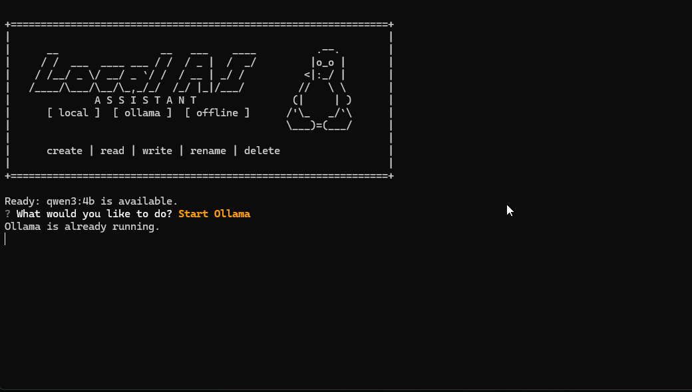

# Local AI Assistant

A Windows CLI assistant that runs fully locally with [Ollama](https://ollama.com). Chat with a local model and let it use tools to create, read, write, rename, and delete files on your machine.

## Demo



## Features

- Local inference through Ollama with no cloud API keys
- Function calling for desktop file tasks
- Interactive menu to start, stop, and check the Ollama server
- Startup checks for Ollama and the required model
- Confirmation prompt before deleting files
- Clean replies with model reasoning kept out of the chat interface

## Requirements

- Windows
- Python 3.10 or newer
- [Ollama](https://ollama.com) installed in its default location:

  `%LOCALAPPDATA%\Programs\Ollama\ollama.exe`

## Setup

Clone the repository:

```powershell
git clone https://github.com/treylog1/Local-AI-assistant.git
cd Local-AI-assistant
```

Create and activate a virtual environment:

```powershell
python -m venv .venv
.\.venv\Scripts\Activate.ps1
```

Install the dependencies:

```powershell
pip install -r requirements.txt
```

Download the model used by the application:

```powershell
ollama pull qwen3:4b
```

## Run

Start the application with Python:

```powershell
python main.py
```

You can also launch it by double-clicking `main.bat`.

## Usage

1. Choose **Start Ollama** if the server is not already running.
2. Choose **Chat**.
3. Ask the assistant to perform a file task, such as:
   - `Create a file called notes.txt on my Desktop`
   - `Read notes.txt from my Desktop`
   - `Rename notes.txt to todo.txt on my Desktop`
   - `Delete todo.txt from my Desktop`
4. Type `exit` to leave the chat and return to the main menu.
5. Choose **Exit and Stop Ollama** or **Exit (Keep Ollama Running)**.

The application always asks for confirmation before deleting a file.

## Project Structure

```text
Local-AI-assistant/
|-- Animation.gif      # Demonstration of the CLI
|-- main.py            # Menu, Ollama lifecycle, chat, and tool loop
|-- tools.py           # Create, read, write, rename, and delete tools
|-- main.bat           # Windows launcher
|-- requirements.txt   # Python dependencies
|-- README.md
```

## How It Works

```text
You -> CLI menu -> Ollama API -> Local model
                         |
                    Tool calls
                         |
              FileTools executes action
                         |
                Result returned to model
```

The application sends Ollama a conversation containing a system prompt, the user messages, and the available file tools. When the model requests a tool, the application executes it and sends the result back to the model. This continues until the model returns its final response.

## Configuration

Defaults in `main.py`:

| Setting | Default |
| --- | --- |
| Model | `qwen3:4b` |
| Ollama API | `http://localhost:11434` |
| Ollama binary | `%LOCALAPPDATA%\Programs\Ollama\ollama.exe` |

To use a different model, change `MODEL` in `main.py` and download that model with Ollama first.

## Dependencies

- `questionary` - interactive CLI menus
- `requests` - communication with the Ollama HTTP API

## Notes

- Prompts and file contents remain on your machine.
- File tools operate on the paths supplied to the model.
- Be specific when asking the assistant to work in a particular directory.
- This project was built as a practical demonstration of local LLM tool calling.
